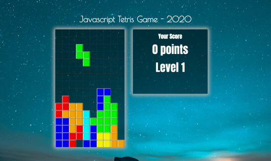

---?color=#0F2862
@snap[north span-100 text-10]
[text-120]# TETRIS
@snapend

@snap[east span-50 text-08]

@snapend

@snap[west span-50 text-08]
@box[bg-purple text-white](First (Game) project for Ironhack's Fullstack Web Development Bootcamp.)
@snapend

@snap[south span-100 text-03]
@box[bg-blue text-white](**By Gilad Tsabar**)
@snapend

---?color=#0F0A0F
## About
+++
### Description

>**Tetris is a tile-matching video game created by Russian software engineer Alexey Pajitnov in 1984. It has been published by several companies, most prominently during a dispute over the appropriation of the game's rights in the late 1980s.**

>Initial release date: June 6, 1984.
>Designer: Alexey Pajitnov

_source: Wikipedia_
---
### Motivation

As an ultimate fan of the Tetris game I'd always had the urge to build my own version of this wonderful game.
---
## Stack
+ This game was written in vanilla ES6 Javascript. CSS3 for formatting and HTML as entry point.

+ All elements in this projects have been created using DOM manipulation in javascript. 

+ For testing I've used Jest.
---
# Classes
+++
## Main
### run
Run class method holds the game logic. this is where the magic happens. At first is the startScreen function is being called.
__startScreen__ initialize the stage, and sets a welcome message for the user, encouraging to start a game.
__startGame__ removes the message and reveals the board. then is the game is initialized (__initGame__) and start to __drop__ the
+++
## Stage
stage holds the everything related with the scene. The background image, app header and the board and score elements.
+++
## Board
The board is a grid of DIV's. If a Tetomino is being placed on the board, the div get a block-cell class and the color style in the appropriate position. Respectively it get cleared if the block is not longer in place.
+++
## Score
Score holds an header and 2 paragraph elements which get updated whenever the the score or the level is changed.
---
## Issues
* As for now this game is not supported by touch screens and small / mobile devices.
* After level five games ends
---
## ToDo
* Change score calculation
* Add touch controls
* Add Responsiveness
* Add an option to see the upcoming tile 
* Add personal highscore for current session / all times / best global score of all users
* Add multiplayer mode over the net
---
### Credits
__Background images:__

*Casey Horner (@mischievous_penguins)*
[Unsplash](https://unsplash.com/photos/G2jAOMGGlPE)

*Jonathan Rados (@jonathanrados)* 
[Unsplash](https://unsplash.com/photos/Sbxt82CsMxA)

*Smit Patel (@mesmitpatel)*
[Unsplash](https://unsplash.com/photos/Ms_ofLBLj68)
